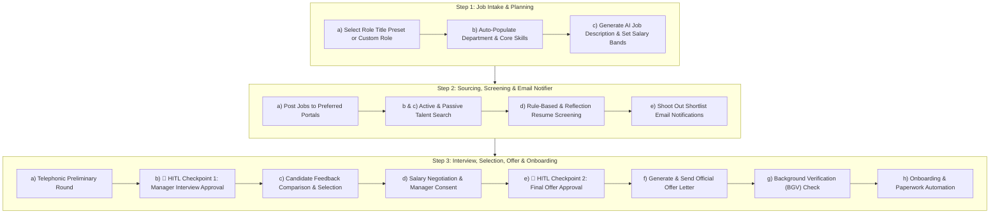

# 🤖 3-Step Autonomous Recruitment & Selection Lifecycle Agent (with Human-in-the-Loop)

An end-to-end autonomous HR Talent Acquisition & Selection AI Agent built with **Python 3.11**, **`uv`**, **LangGraph** (featuring self-correction loops and Human-in-the-Loop checkpoints), **Gradio** web UI, and the **DeepSeek API**.


---

## 🌟 3-Step Lifecycle Workflow



---

## 🔑 Key Features

### **Step 1: Job Intake & Planning**
- **Role Title Presets & Customization**: Select industry role titles (*Senior AI Engineer, Lead Full-Stack Dev, Senior Data Scientist, GenAI PM, DevOps Architect, HR Specialist*). Selecting a role **automatically customizes Department, Core Skills, and Salary Bands**.
- **Need Definition**: Specifies open position title, department, required core skills, and urgency.
- **AI Job Description Generator**: Generates structured, professional JDs matching role requirements.
- **Salary Band Configurator**: Sets minimum & maximum target compensation ranges (e.g. ₹18 LPA - ₹28 LPA).

### **Step 2: Sourcing, Portal Selection & Email Shootout**
- **Preferred Job Portal Selector**: Explicit dropdown to select LinkedIn Recruiter & Jobs, Naukri India, Indeed, Foundit (Monster), Internal Employee Referral, or Local Folder.
- **Customized Job Posting Generator**: Generates platform-tailored job advertising announcements for prospective candidates on the selected portal.
- **Rules & Reflection Resume Screening**: Evaluates candidate experience, work mode fit (*Remote/Office/Hybrid*), location, salary fit, and core skills with iterative self-correction loops.
- **Interactive Email Shootout**: Shoots out automated, personalized shortlist notification emails to selected candidates with delivery timestamp and status.

### **Step 3: Interview, Selection, Offer & Onboarding**
- **Telephonic Preliminary Round**: AI conducts preliminary telephonic screening checking candidate interest, notice period, availability, and culture fit.
- **🛑 Human-In-The-Loop (HITL) Checkpoint 1**: Manager decision panel to review candidate pool and approve scheduling technical & prospective manager interview rounds.
- **Feedback Comparison & Candidate Selection**: Aggregates interviewer notes and ranks candidates for final selection.
- **🛑 Salary Negotiation & HITL Checkpoint 2**: Conducts salary negotiation and requires explicit manager approval before finalizing the job offer.
- **Official Offer Letter Generator**: Issues formal offer letter with agreed CTC, joining bonus, and Date of Joining (DOJ).
- **Background Verification (BGV)**: Simulates automated BGV checks (Employment History, Education Verification, Criminal Check).
- **Onboarding & Paperwork Automation**: Auto-generates new hire paperwork checklist, IT hardware allocation, and Week 1 orientation schedule.

---

## 🚀 Quickstart Guide

### 1. Installation via `uv`

```bash
# Clone repository
git clone https://github.com/Sangeethacg42/recruitment-selection-agent.git
cd recruitment-selection-agent

# Install dependencies using uv
uv sync
```

### 2. Configure DeepSeek API Key

Create `.env`:
```env
DEEPSEEK_API_KEY=sk-your-deepseek-api-key
DEEPSEEK_BASE_URL=https://api.deepseek.com
DEEPSEEK_MODEL=deepseek-chat
```

### 3. Launch Application

```bash
uv run main.py
```
Open browser at: **`http://127.0.0.1:8050`** (or `http://localhost:8050`)

---

## 🐳 Docker Deployment

```bash
# Build image
docker build -t recruitment-agent .

# Run container
docker run -p 7860:7860 -e DEEPSEEK_API_KEY="sk-your-api-key" recruitment-agent
```
